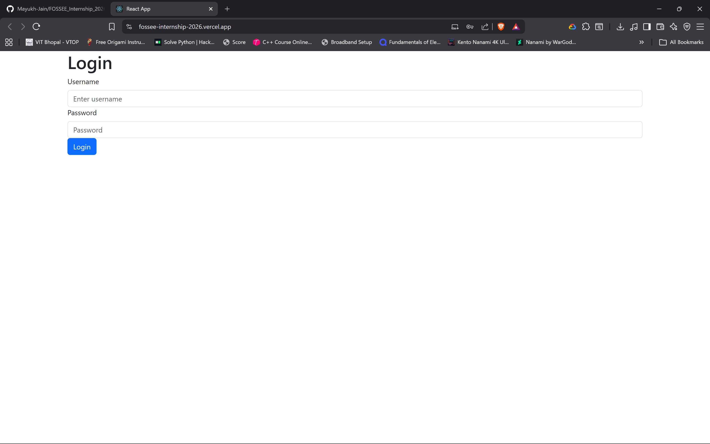
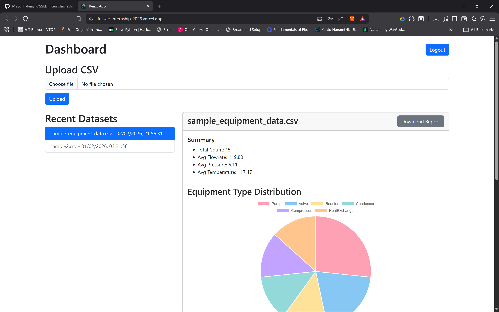
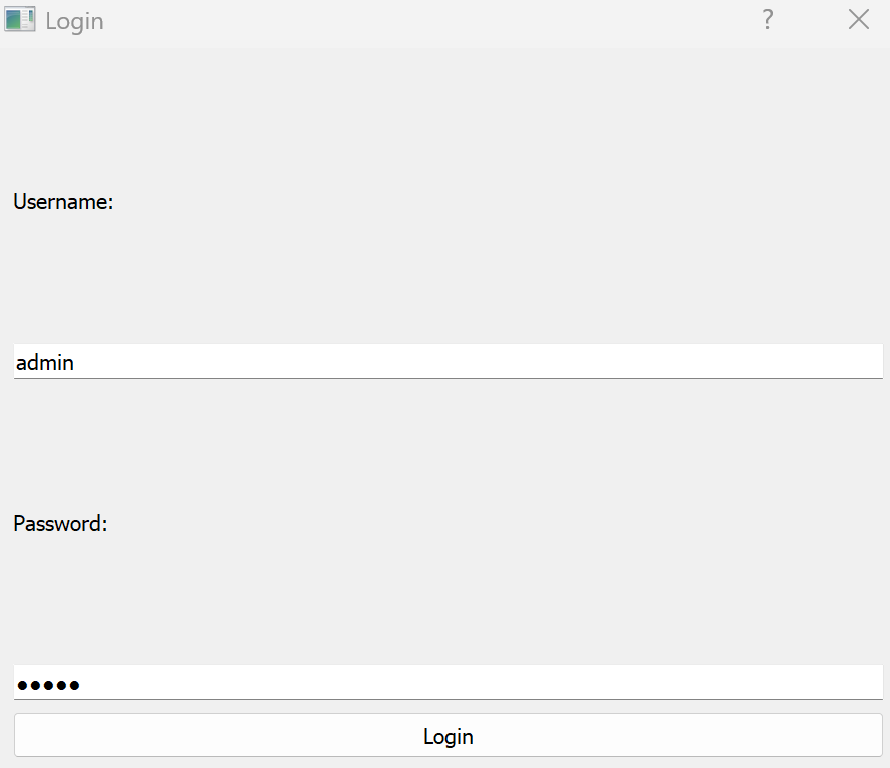
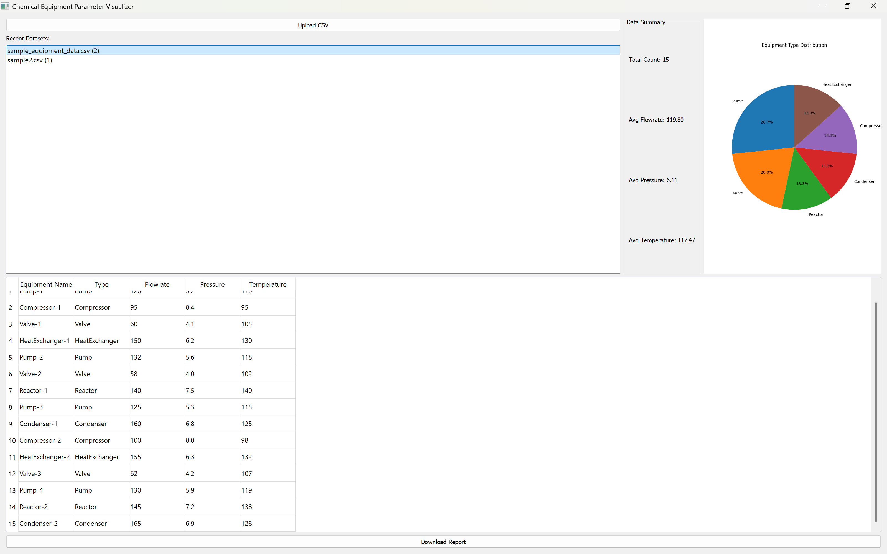
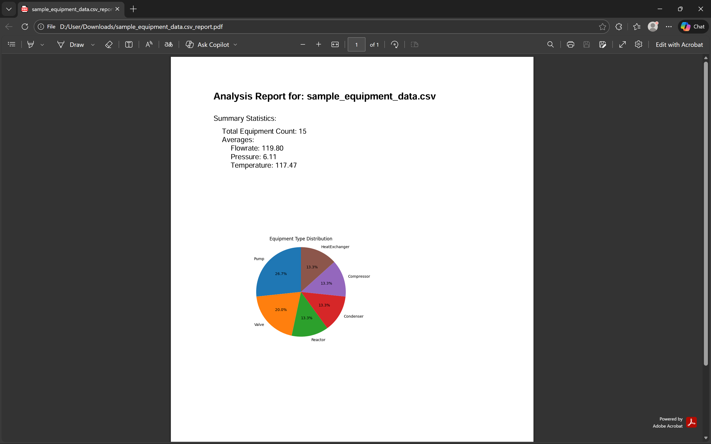

# Chem-Vis: Full-Stack Data Visualization Platform

Chem-Vis is a comprehensive, full-stack application designed for uploading, analyzing, and visualizing chemical equipment data. It features a robust backend API, a dynamic web interface, and a native desktop client, demonstrating a complete end-to-end software development and deployment workflow.

---

## Features

- **Secure User Authentication:** JWT-based authentication ensures secure access to the platform.
- **CSV Data Upload:** Easily upload equipment datasets in CSV format via the web or desktop interface.
- **Automated Data Analysis:** The backend automatically processes uploaded data to generate key statistics, including averages, value counts, and total records.
- **Interactive Web Dashboard:** A responsive, web-based dashboard for viewing dataset summaries, visualizing data distributions with interactive charts, and inspecting raw data in a paginated table.
- **Native Desktop Client:** A standalone desktop application offering a native user experience with the same core functionalities.
- **PDF Report Generation:** The desktop client can generate and export detailed PDF reports containing data summaries and visualizations for offline analysis and sharing.
- **Cloud-Native Deployment:** The entire platform is deployed on modern, scalable, and cost-effective cloud infrastructure.

---

## Screenshots

<table>
  <tr>
    <td align="center"><strong>Web App: Login Page</strong></td>
    <td align="center"><strong>Web App: Main Dashboard</strong></td>
  </tr>
  <tr>
    <td></td>
    <td></td>
  </tr>
  <tr>
    <td align="center"><strong>Desktop App: Login Window</strong></td>
    <td align="center"><strong>Desktop App: Main Window</strong></td>
  </tr>
  <tr>
    <td></td>
    <td></td>
  </tr>
   <tr>
    <td align="center" colspan="2"><strong>Generated PDF Report</strong></td>
  </tr>
    <tr>
    <td colspan="2" align="center"></td>
  </tr>
</table>

---

## Tech Stack & Architecture

This project utilizes a decoupled frontend/backend architecture.

#### **Backend**
- **Framework:** Django & Django Rest Framework
- **Database:** PostgreSQL (hosted on Supabase)
- **Authentication:** `djangorestframework-simplejwt` for JSON Web Tokens
- **Data Processing:** Pandas
- **PDF Generation:** ReportLab
- **Deployment:** Docker container on Hugging Face Spaces
- **WSGI Server:** Gunicorn

#### **Web Frontend**
- **Framework:** React.js
- **API Client:** Axios
- **Styling:** Bootstrap
- **Deployment:** Vercel

#### **Desktop Frontend**
- **Language:** Python
- **GUI Framework:** PyQt5
- **Executable Packaging:** PyInstaller

---

## Project Structure

The repository is organized into three main components:

```
.
├── backend/                # Django REST Framework Backend
│   ├── api/                # Core Django app for views, models, serializers
│   ├── chem_vis_project/   # Django project settings and main URLs
│   └── ...
├── frontend_web/           # React.js Web Application
│   └── chem-vis-web/
│       ├── public/
│       ├── src/            # Main React source code
│       └── ...
├── frontend_desktop/       # PyQt5 Desktop Application
│   ├── api_client.py       # Handles communication with the backend
│   └── main.py             # Main application entry point
├── Dockerfile              # Defines the backend container for deployment
├── netlify.toml            # Build configuration for Netlify (alternative to Vercel)
└── README.md
```

---

## Setup and Deployment

This section outlines the steps to set up the development environment and deploy the applications. A live version of the web app is hosted on Vercel, with the backend on Hugging Face Spaces.

### Accessing the Deployed Applications

- **Web Application (Live):** You can access the live web application here: `https://fossee-internship-2026-ofh6o3wi5-mayukhs-projects-769c77b4.vercel.app/`
  - **Login Credentials:** `username: admin`, `password: admin`
  - Use `username: admin`, `password: admin` to log in.
- **Desktop Application (.exe):** After running PyInstaller (see "Desktop Frontend Setup" below), the standalone executable `main.exe` will be located in the `frontend_desktop/dist/` folder. This executable also connects to the live backend.

### Prerequisites
- Python 3.9+ & `pip`
- Node.js & `npm`
- Git

### Backend Deployment (Hugging Face)
1.  **Database:** Create a PostgreSQL database on [Supabase](https://supabase.com).
2.  **Hugging Face Space:** Create a new "Docker" Space on Hugging Face.
3.  **Secrets:** In the Space settings, add your `DATABASE_URL` (from Supabase, using the connection pooler URI) and a new `SECRET_KEY`.
4.  **Push Code:** Push the project repository to the Hugging Face Space repository. The `Dockerfile` will be used to build and deploy the application. Gunicorn starts the server and `manage.py migrate` is run automatically.

### Web Frontend Deployment (Vercel)
1.  **Vercel Project:** Connect your Git repository to a new Vercel project.
2.  **Configuration:** In the Vercel project settings:
    - Set the **Root Directory** to `frontend_web/chem-vis-web`.
    - Add an environment variable `REACT_APP_API_URL` pointing to your live Hugging Face backend URL.
3.  **Deploy:** Vercel will automatically build and deploy the site upon a `git push`.

---

## Credits

This project was created by **Mayukh Jain**. It demonstrates a comprehensive understanding of full-stack development, modern deployment practices, and the integration of multiple technologies to build a functional, end-to-end application.
